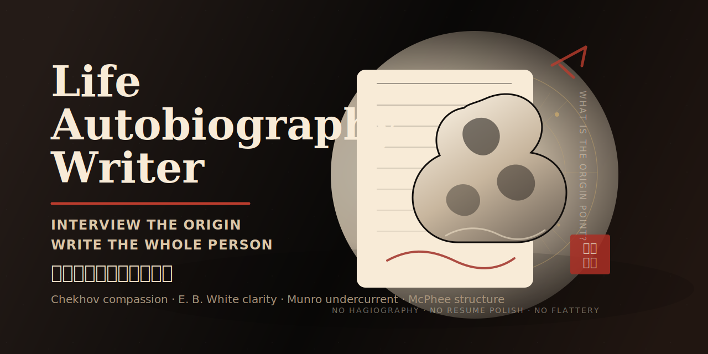

# Life Autobiography Writer

[English README](README.md)

> 一个用于写人生自传、人物小传和文学性人物侧写的 Agent Skill。
>
> 不写彩虹屁。写承认。

很多“自传写作”最后会写成两种东西：

- 更漂亮的简历；
- 更委婉的夸奖。

但一个真正有意思的人，往往不在这些东西里。TA 在选择里，在代价里，在关系里，在反复出现的小动作里，在一句别人塞给 TA 的话里，在某个仍然发烫的童年场景里，也在那些不太好看的矛盾里。

这个 skill 的目标，是让你的 personal agent 能像一个好的传记作者一样工作：多方追问，挖出人生原点，拆开自我神话，找到核心饥饿，把一个人写得立体、有魅力，但不谄媚。

## 它解决什么问题

普通人物介绍太像履历：

```text
她毕业于某某学校，曾任某某职位，拥有丰富经验，是一位优秀的……
```

这类文字没有错，但没有人味。读者看完知道这个人“厉害”，却不知道这个人为什么变成了这样，也不知道 TA 的厉害付出了什么代价。

Life Autobiography Writer 会让 agent 先问更深的问题：

- 这个人的人生原点是什么？
- TA 一生的核心饥饿是什么？
- 哪个童年或青年场景仍然有热度？
- TA 的优点伤害过什么？
- TA 的缺点保护过什么？
- TA 自己讲述的人生神话里，哪一句过于光滑？
- 如果敌人来写 TA，会写对什么？
- 如果爱 TA 的人来写 TA，又会拒绝承认什么？

## 核心能力

- 设计深度采访问题，覆盖原点、家庭、关系、羞耻、野心、身体、工作、转折点。
- 把零散笔记、访谈记录、用户画像、时间线整理成“人生地图”。
- 写第三人称人物小传，也能写第一人称 memoir 章节。
- 内置“美乃里式采访”方法：被人物吸引，但不轻信人物给出的官方版本。
- 植入汪曾祺式中文写作机制：先有物，再有人；先有动作，再有情绪；先有场景，再有意义。
- 最后做“反彩虹屁”修订，让人物可亲、复杂、有光，也有阴影。

## 适合谁用

- 想写个人自传或人生故事的人
- 做创始人、创作者、研究者人物稿的人
- 想给家人写一份不俗气的小传的人
- 做 personal agent 写作工作流的人
- 需要把访谈材料写成文学性非虚构的人
- 想写中文人物稿，但不想要 AI 腔、鸡汤腔、品牌稿腔的人

## 仓库结构

```text
life-autobiography-writer/
├── SKILL.md
├── agents/
│   └── openai.yaml
├── references/
│   ├── anti-flattery.md
│   ├── autobiography-craft.md
│   ├── biographical-prose-style.md
│   ├── drama-method.md
│   ├── minori-style-interview.md
│   ├── question-bank.md
│   └── vendor/
│       └── wangzengqi-perspective/
│           └── SKILL.md
└── assets/
    └── github-header.svg
```

## Quickstart：Codex / Codex App

作为个人 skill 安装：

```bash
mkdir -p ~/.codex/skills
git clone https://github.com/chengjialu8888/life-autobiography-writer.git \
  ~/.codex/skills/life-autobiography-writer
```

重启 Codex，让 skill metadata 重新加载。

可以这样开始：

```text
Use $life-autobiography-writer to interview me and write a third-person literary life profile.
```

或者直接给材料：

```text
Use $life-autobiography-writer to write a vivid autobiography sample from this profile.
Make it third-person, Chinese, restrained, and not flattering.
```

## Quickstart：Claude Code

Claude Code 支持以 `SKILL.md` 为入口的 Agent Skills。

安装为个人 skill：

```bash
mkdir -p ~/.claude/skills
git clone https://github.com/chengjialu8888/life-autobiography-writer.git \
  ~/.claude/skills/life-autobiography-writer
```

安装为项目 skill：

```bash
mkdir -p .claude/skills
git clone https://github.com/chengjialu8888/life-autobiography-writer.git \
  .claude/skills/life-autobiography-writer
```

重启 Claude Code 后，可以这样用：

```text
Use $life-autobiography-writer to turn these interview notes into a chapter outline and opening scene.
```

当你的请求与 skill 描述匹配时，Claude Code 也可能自动加载它。

## Quickstart：其他 Personal Agents

如果你的 agent 支持 Agent Skills 文件夹格式，把本仓库作为一个 skill 目录安装即可，确保 `SKILL.md` 在 skill 根目录。

如果你的 agent 暂时不支持 skill 机制：

1. 把 `SKILL.md` 加入高优先级 instructions。
2. 把 `references/` 作为知识库或可检索上下文。
3. 告诉 agent 只读取当前任务需要的 reference 文件。
4. 用下面这样的 prompt 触发：

```text
Follow the Life Autobiography Writer skill.
First build a life map from the source material.
Then write a third-person literary profile.
Use the anti-flattery pass before finalizing.
```

## 示例 Prompt

```text
Use $life-autobiography-writer to interview me.
Start from the question: what is the origin point of my life?
Do not write yet. First ask 10 sharp questions.
```

```text
Use $life-autobiography-writer to turn this founder timeline into a literary profile.
Make the person legible, complex, and attractive without sounding like PR.
```

```text
Use $life-autobiography-writer to write a Chinese third-person autobiography sample.
Use concrete objects, work scenes, relationships, and body costs.
Do not start with education or job titles.
```

```text
Use $life-autobiography-writer to revise this draft.
Remove flattery, add contradiction, and make the feeling land in scenes instead of abstract praise.
```

## 写作理念

这个 skill 有四条底层原则：

1. 人生不是简历。
2. 人比自己的公共神话更有意思。
3. 魅力来自具体性和矛盾，不来自形容词。
4. 好的情感写作，常常把情绪藏在物、动作、天气、房间、工具、食物和关系里。

中文输出默认使用第三人称文学性非虚构风格，并植入汪曾祺式写作机制：语言平实，细节有味，贴着人物写，情绪不喊破。

## 内置参考模块

- `question-bank.md`：人生原点、家庭、工作、羞耻、野心、关系、意义等采访问题。
- `minori-style-interview.md`：从“人生原点”和“核心饥饿”切入的采访法。
- `drama-method.md`：电视剧式戏剧脊柱、转折、配角、母题和结尾方法。
- `autobiography-craft.md`：自传、回忆录、人物传记的写作工艺。
- `biographical-prose-style.md`：中文第三人称人物小传笔法。
- `anti-flattery.md`：反彩虹屁修订规则。
- `vendor/wangzengqi-perspective/SKILL.md`：完整植入的汪曾祺式中文写作 skill。

## 建议 GitHub Topics

`agent-skills`, `codex`, `claude-code`, `personal-agent`, `memoir`, `autobiography`, `biography`, `writing`, `ghostwriting`, `chinese-writing`, `literary-nonfiction`

## 贡献

欢迎 PR，尤其欢迎：

- 更锋利的采访问题集；
- 不同类型人物稿的示例；
- 更强的反彩虹屁修订规则；
- 更多 personal agent 的安装说明；
- 多语言人物写作适配。

如果你发现某类人生材料特别难写，也可以开 issue，直接贴问题场景。

## Star 一下

如果这个 skill 帮你的 agent 把人写得更像一个完整的人，而不是一份打磨过的 LinkedIn 简介，欢迎给仓库点个 Star。它会帮助更多写作者、创始人、研究者和 personal-agent builder 发现这个项目。

## 占位符提醒

本文档没有使用虚构 benchmark 或使用量数据。如果你 fork 本项目，只需要替换仓库 URL。
